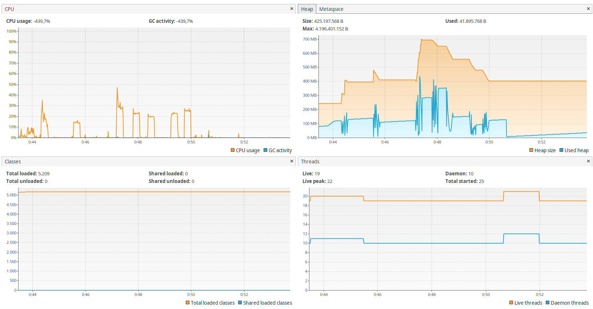

## Mok Server

Server developed in Ktor that mocks responses configured through a yaml file.

You can match:
* The request path
* Headers
* Query parameters

You can also replace values on the response payload with values on the headers or query string for enhanced flexibility

Current performance (the highest CPU was achieved during a 10000TPS test)

